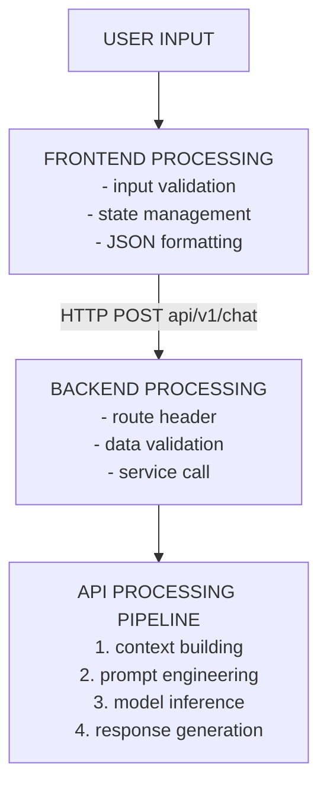
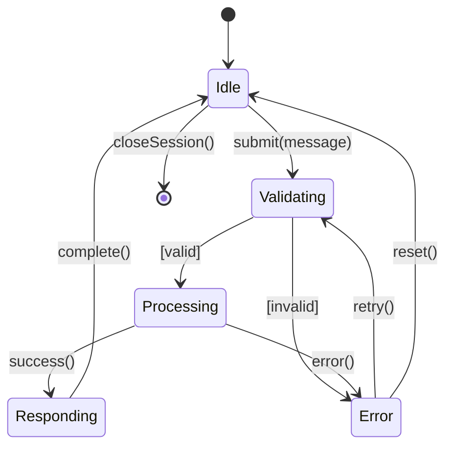

# AI Chat Assistant using Google Gemini
A chat assistant built end-to-end: a frontend that validates and formats user
input, a backend that routes and re-validates the request, and an API layer that
builds context, assembles the prompt, runs inference, and returns a response.

## Architecture Diagram

## System Architecture
**Frontend (React):**
-> captures user input
-> displays AI responses
-> handles real-time interactions

**Backend (Python):**
-> processes requests
-> manages API calls
-> handles business logic

**AI Layer (Gemini):**
-> generaters intelligent responses
-> processes natural language
-> provides AI capabilities

## State Diagram 

### States

| State | Meaning |
| --- | --- |
| VALIDATING | input validation and formatting |
| PROCESSING | AI API call in progress |
| RESPONDING | displaying AI response |

